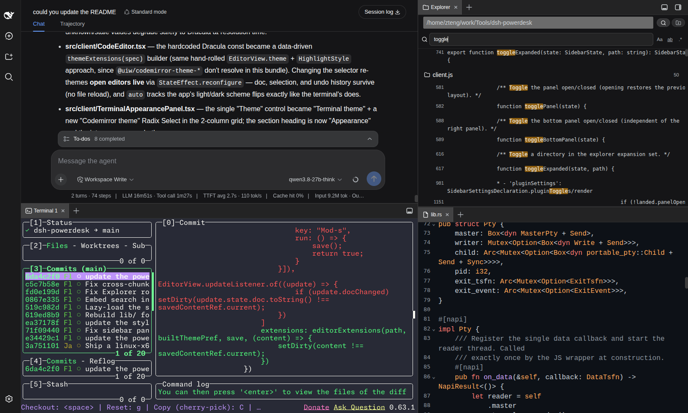
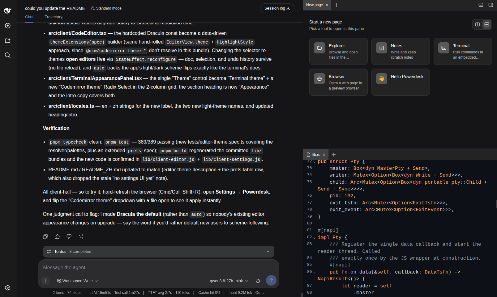
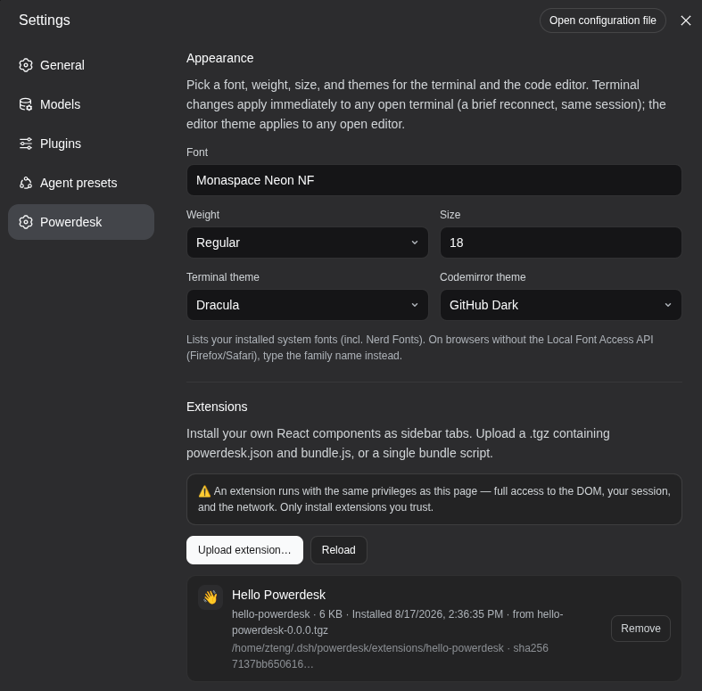

# dsh-powerdesk

<a href="README.md">English</a> | <strong>简体中文</strong>

一个 [DSH](https://github.com/deepseek-ai/dsh) Web 插件，为 DSH 的 Web 界面加上一个
小型 IDE 工作台：GPU 加速的**终端**、**文件浏览器**、**笔记**、**代码编辑器**，以及
一个沙箱化的**浏览器** —— 全部自包含，置于一个可停靠的右侧面板 *和* 一个可停靠的
底部面板中（VSCode 风格的双工作台，支持拖拽分屏与跨面板拖拽）。

- **终端** —— 用 [restty](https://github.com/wiedymi/restty) 渲染
  （WebGPU/WebGL2 + WASM VT，Ghostty 血统），后端是 **Rust PTY**
  （[napi-rs](https://napi.rs) + [portable-pty](https://docs.rs/portable-pty/latest/portable_pty/)），
  而非原生终端使用的 C++ `node-pty`。
- **文件浏览器** —— 在任意本地文件夹（通过内置文件夹浏览弹窗选取，而非文本输入框）之上
  呈现的目录树。点击文件即在编辑器中打开；每个文件行都有快捷的「复制相对路径」（便于
  在聊天中 @ 提及）和「复制绝对路径」操作。
- **笔记** —— 绑定一个本地文件夹，以递归树浏览/编辑其下的 `.md` 文件，支持笔记与
  文件夹的内联新建 / 重命名 / 删除。编辑器内嵌于同一标签页（左侧树、右侧编辑器）。
- **编辑器** —— [CodeMirror 6](https://codemirror.net/)，支持
  TS/JS/Python/JSON/CSS/HTML/Markdown/Rust/YAML 语法高亮、可选择的 CodeMirror
  主题（默认 Dracula）、软换行、Cmd/Ctrl+S 保存。在文件浏览器或笔记中点击文件时自动打开。
- **浏览器** —— 地址栏背后的沙箱 iframe，带有可嵌入性探测，能解释
  `X-Frame-Options` / `frame-ancestors` 拒绝原因，而不是显示空白的「拒绝连接」框。

这五个功能都以标签页形式出现在插件自有的侧边栏中 —— 一个**右侧面板**（宽度自由
拖拽、无上限）和一个**底部面板**（高度可拖拽，横向铺满整个窗口宽度，包括右侧面板下方）。



## 为何选择 Powerdesk

1. **真正快的终端** —— [restty](https://github.com/wiedymi/restty)（WebGPU/WebGL2 + WASM VT，Ghostty 血统）渲染于 **Rust PTY**（[napi-rs](https://napi.rs) + [portable-pty](https://docs.rs/portable-pty/latest/portable_pty/)）之上，而非原生终端使用的 C++ `node-pty` —— 终端 I/O 显著更快、更轻量。
2. **不离开聊天的完整 IDE** —— ripgrep 内容搜索、CodeMirror 6 编辑器、文件浏览器、笔记、沙箱浏览器，全部作为标签页置于可停靠的右面板 + 底面板中。无需上下文切换离开 DSH 页面。
3. **双面板 VSCode 风格工作台** —— 把任意标签页拖到面板边缘即可分屏，或在右/底面板之间整体迁移；两棵分屏树共享同一套拖拽系统。
4. **零构建安装** —— `lib/` 与 macOS / Linux-x64 的 Rust PTY 二进制均已提交，`dsh plugin add` 只是拷贝文件：无构建步骤、无需 Rust 工具链、无需 `allowBuilds` 条目。
5. **打造你自己的标签页** —— 把一个 React 组件加 `powerdesk.json` 打包成 `.tgz`，即挂载为侧边栏标签页；模板（`templates/extension/`）让你几分钟内 `pnpm pack` 出成品。
6. **默认沙箱化** —— 浏览器标签页不带 `allow-same-origin` 运行，拒绝回环地址，并探测 `X-Frame-Options` / `frame-ancestors` 以解释拒绝原因，而非显示空白框。

## 快速安装

```bash
dsh plugin --profile web add https://github.com/FleetingEcho/dsh-powerdesk.git
```

需要 [DSH](https://github.com/deepseek-ai/dsh) `>=0.0.1`，且 `dsh` CLI 在 `PATH` 中。安装后硬刷新浏览器（Cmd/Ctrl+Shift+R）。终端在 macOS（两种架构）与 Linux x86_64 上开箱即用；其它平台首次使用时构建一次 Rust PTY（见[安装](#安装)）。

---

## 环境要求

- **DSH** `>=0.0.1`，且 `dsh` CLI 在 `PATH` 中（`dsh --version`）。加载进某个 DSH profile（默认 `web`）。
- **Node.js 20+** 和 **pnpm 9+**（若从源码安装）。
- **Rust 工具链**（`rustup`）—— 仅当你的平台还没有已提交的预编译二进制时才需要；macOS 用户永远不需要 Rust。

PTY 插件按平台三元组查找（`src/rust-pty-deps.ts`）。三个三元组已有已提交到仓库的二进制，随每次安装分发；其余平台首次使用时从源码构建：

| 操作系统 | 架构 | 三元组 | 预编译？ |
| --- | --- | --- | --- |
| macOS | Apple Silicon | `darwin-arm64` | ✅ 已提交 |
| macOS | Intel | `darwin-x64` | ✅ 已提交 |
| Linux | x86_64 (glibc) | `linux-x64-gnu` | ✅ 已提交 |
| Linux | aarch64 (glibc) | `linux-arm64-gnu` | 从源码构建 |
| Windows | x86_64 | `win32-x64-msvc` | 从源码构建 |
| Windows | ARM64 | `win32-arm64-msvc` | 从源码构建 |

---

## 安装

**只选一种** —— 不要同时启用两个通道（会让 host 半边双重挂载并渲染出两个侧边栏）。目前没有发布 npm 包，两个通道都直接从 GitHub 仓库安装。

### 方式 A —— 从 GitHub（推荐）

```bash
dsh plugin --profile web add https://github.com/FleetingEcho/dsh-powerdesk.git
```

仓库是公开的，因此普通 HTTPS URL 即可匿名安装。pnpm 会从仓库里读出包名，不需要 `dsh-powerdesk@` 前缀 —— 不过 `dsh-powerdesk@<url>` 可用来锁定分支或标签（`...git#my-branch`）。偏好 SSH？`git+ssh://git@github.com/FleetingEcho/dsh-powerdesk.git` 也可以（需要 GitHub 上已注册 SSH key）。

`lib/`（构建好的 client/host JS）与 macOS / Linux-x64 的 Rust PTY 二进制都已提交，因此无构建步骤、无需 `allowBuilds` —— 终端在这些平台上立即可用。

<details>
<summary>Windows 或 Linux ARM64：构建一次 Rust PTY</summary>

```bash
cd ~/.dsh/profiles/web/node_modules/dsh-powerdesk
pnpm build:rust       # 需要 Rust 工具链（rustup）；cargo build --release
```

</details>

### 方式 B —— 从源码（用于开发）

```bash
git clone https://github.com/FleetingEcho/dsh-powerdesk.git
cd dsh-powerdesk
pnpm install
pnpm build            # tsc (lib/types) + tsdown (lib/*.js + 懒加载 chunk)
pnpm build:rust       # cargo build --release → prebuilt/<triple>/dsh_powerdesk_pty.node
pnpm test             # vitest（可选自检）

# 把本地 checkout 注册到你的 DSH profile。
# 用绝对路径（link:. 相对于 profile 目录解析会损坏）：
dsh plugin --profile web add "dsh-powerdesk@link:$PWD"
```

任一方式之后：**硬刷新浏览器**（Cmd/Ctrl+Shift+R）。客户端半边改动热重载无需重启 DSH；host 半边改动（`src/*.ts`，含 Rust PTY 层）需重启 DSH（`pm2 restart dsh-web`，或 `dsh web`）。

---

## 使用

点击窗口右上角的切换按钮簇 —— 一个打开/折叠**右面板**，另一个控制**底面板**。把标签页拖到面板边缘即可分屏，拖到中心则合并/重排，从一个面板拖到另一个则整体迁移。每个打开的标签页在非活动时都保持挂载，因此切换标签页不会丢掉终端的连接或编辑器的撤销历史。

### 终端

在当前会话的工作目录打开；每个会话可开多个终端，直到配置的配额上限（标签页标题显示序号：`Terminal 1`、`Terminal 2`、…）。工具栏有**复制**按钮。字体家族 / 字重 / 大小与终端主题是持久化偏好 —— 在「设置 → Powerdesk」编辑。如果原生 PTY 二进制缺失或加载失败，终端会显示带修复命令的修复横幅（见[修复](#修复)）。

### 文件浏览器

点击头部的文件夹名按钮打开文件夹浏览弹窗（逐级点入子目录，「选择此文件夹」）。可添加多个文件夹书签并从同一按钮切换。点击目录行展开，点击文件行即在编辑器中打开（打开文件会自动把文件浏览器分到独立面板一次，避免编辑器叠在上面）。悬停文件行显示：**@** 复制相对于书签根的路径（便于 @ 提及），另一个复制图标复制绝对路径。

### 笔记

首次使用会提示绑定一个文件夹（随时可点击文件夹名重新绑定）。笔记递归列出该文件夹下所有 `.md` / `.markdown` 文件 —— 子树中不含 markdown 的目录会被整枝剪掉 —— 并在树（左）旁呈现内联编辑器（右，可经分隔条调节），两者同处一个标签页。头部操作：新建笔记、新建文件夹；每个文件的操作（悬停）：重命名、删除（删除文件夹是递归的）。

### 编辑器

不直接打开 —— 它是文件浏览器和笔记打开文件的目标。基于 CodeMirror 6，支持 TypeScript/JavaScript、Python、JSON、CSS、HTML、Markdown、Rust、YAML 语法高亮；可选择的 CodeMirror 主题（默认 Dracula），在「设置 → Powerdesk」选择，并对已打开的编辑器即时生效（`auto` 跟随应用明暗模式）。软换行；Cmd/Ctrl+S 写回。有未保存编辑时标签页显示一个脏点。

### 浏览器

在地址栏输入 URL 回车。地址栏上有后退 / 前进 / 刷新 / 在浏览器中打开按钮。

- **沙箱** —— iframe 不带 `allow-same-origin` 运行（被访问页面无法读取 GUI 的存储或访问其 API），也不带 `allow-top-navigation`。一个临时**解锁**按钮会为可信站点放下沙箱；沙箱关闭时红色状态条告警。
- **地址栏** —— 只接受 `http`/`https`；`javascript:`、`data:`、`file:` 被拒绝。回环地址（`localhost`、`127.0.0.0/8`、`::1`、`0.0.0.0`）被拒绝，以免被浏览页面探测本地服务。
- **嵌入拒绝** —— 当站点设置 `X-Frame-Options` / 不允许 `*` 的 `frame-ancestors` CSP 时，插件会先探测 header，并显示带**「在浏览器中打开」**和**「强制加载」**的原因面板，而非空白框。这是浏览器层面强制的、按站点的限制；「在浏览器中打开」是从这里查看此类站点的唯一方式。
- **外链** —— 浏览器标签页认领 `http://` 外链点击（聊天中点 http 链接在侧边栏打开）；`https://` 留给系统浏览器。

### 设置

「设置 → Powerdesk」为每种标签类型显示一张带启用开关的卡片 —— 关闭某标签类型会把它从每个面板的 `+` 菜单隐藏，并使 `openTab` 对它空操作（持久化在 `localStorage`）。点击卡片主体即打开该功能面。



卡片下方是一个**外观**区块，包含终端的字体家族 / 字重 / 大小，以及两个主题选择器 —— **终端主题**与**Codemirror 主题** —— 各带「系统默认」选项以跟随应用明暗模式。任一更改都会即时应用到已打开的终端 / 编辑器。



---

## 更新

```bash
# 方式 A（GitHub 通道）—— pnpm 固定已解析的 commit，升级需移除再添加：
dsh plugin --profile web remove dsh-powerdesk
dsh plugin --profile web add https://github.com/FleetingEcho/dsh-powerdesk.git

# 方式 B（源码）—— 拉取、重建，仅在改了 host 半边时重启：
git pull && pnpm install && pnpm build && pnpm build:rust
```

然后硬刷新浏览器。host 半边改动需重启 DSH；客户端半边只需硬刷新。

## 卸载

```bash
dsh plugin --profile web remove dsh-powerdesk
# 源码通道：还需回退你加到 profile 的 link: 依赖，再 pnpm install。
```

硬刷新（或重启 DSH）让挂载行消失。

---

## 修复

如果终端显示 "Rust PTY loading failed" —— 即原生 PTY 二进制缺失、损坏或为错误平台构建 —— 就地重建（无需重装）：

```bash
cd ~/.dsh/profiles/web/node_modules/dsh-powerdesk   # GitHub 通道
#   — 或你的本地 dsh-powerdesk checkout              # 源码通道
pnpm build:rust                                      # 需要 Rust 工具链（rustup）
```

然后硬刷新并重启 DSH（host 半边启动时重新读取二进制）。

## 安装排错

**插件安装但未加载** —— 检查 bundle 行是否已添加；`dsh.profile.bundles` 必须在依赖旁列出 `dsh-powerdesk`：

```bash
cat ~/.dsh/profiles/web/package.json
```

如果依赖在但 bundle 行不在，插件就以普通依赖挂载、永不加载 —— 这是损坏的 `link:` 安装的症状（见方式 B 注释）；用绝对路径或「安装 → 方式 A」的 git URL 重新添加。host 半边改动只在 DSH 重启后生效。

---

## 配置

### 插件配置（在 `dsh.profile.bundles` 中）

```yaml
dsh-powerdesk:
  terminalsPerSession: 3      # 每个会话的最大活动终端数
  reconnectGraceMs: 30000     # 掉线的 pty 保持这么久以便重连
  shell: ''                   # 覆盖交互式 shell（'' 则自动探测）
  extensionsEnabled: false    # 允许用户安装扩展（见「扩展」）
  extensionsDir: ''           # 扩展存放位置（'' = ~/.dsh/powerdesk/extensions）
```

### 用户偏好（`localStorage`，无 host 往返）

| 偏好 | 存储 key | 说明 |
| --- | --- | --- |
| 终端字体家族 / 字重 / 大小 / 主题；CodeMirror（编辑器）主题 | `dsh-powerdesk:prefs` | 在「设置 → Powerdesk」（外观）中编辑。 |
| 文件浏览器文件夹书签 | `dsh-powerdesk:explorer-bookmarks` | 多个书签及当前活动项。 |
| 笔记绑定文件夹 | `dsh-powerdesk:notes-folder` | 单个文件夹，可重绑。 |
| 笔记树列宽 | `dsh-powerdesk:notes-tree-width` | 经分隔条拖拽。 |
| 每种标签类型的开关 | `dsh-powerdesk:tabs-enabled` | 从设置卡片设置。 |

### 环境变量

| 变量 | 用途 |
| --- | --- |
| `DSH_POWERDESK_PTY_PATH` | 指向 `.node` 插件的绝对路径；优先级高于一切解析。 |
| `DSH_POWERDESK_PTY_TRIPLE` | 覆盖探测到的平台三元组（如 `linux-x64-musl`）。 |
| `DSH_RESTTY_SHELL` | 覆盖 Windows shell 探测（默认：PATH / 已知安装目录中第一个 `pwsh.exe`，否则 `powershell.exe`）。 |
| `PREBUILT_BASE` | 覆盖预编译二进制下载基 URL（默认：GitHub releases）。 |
| `DSH_HOME` | 覆盖 DSH home（默认 `~/.dsh`）。 |
| `DSH_CMD` | 覆盖 `install.sh` 使用的 `dsh` CLI（默认：`dsh`，然后 `npx`）。 |

---

## 扩展

Powerdesk 可以把**你自己的 React 组件**挂载为侧边栏标签页。一个扩展就是一个打包脚本加一份 `powerdesk.json` 清单，以 `.tgz` 从设置卡片上传。

### 安全 —— 先读这一段

扩展运行在 **DSH 页面自身的 origin** 内，对 DOM、你的会话和网络有完全访问权 —— 与 Powerdesk 自身特权相同。没有沙箱（且在扩展共享 host 的 React 实例的前提下也不可能存在）。这是一个**可信本地扩展**功能，不是市场：只安装你读过代码或信任作者的代码。该功能**默认关闭** —— 有意开启：

```yaml
dsh-powerdesk:
  extensionsEnabled: true
```

### 安装 / 移除

**设置 → Powerdesk → 扩展 → 上传扩展…** 接受的上传（按字节而非文件名判定）：`.tgz` / `.tar.gz` / `.tar`（根目录必须含 `powerdesk.json`），或裸 `.js` / `.js.gz`（卡片询问 id 和显示名）。每个扩展原子安装到 `<extensionsDir>/<id>/`；卡片显示磁盘路径和来源归档的 sha256。**移除** 删除该目录；想不卸载就禁用，用其卡片上的开关。

### 编写

```bash
cp -r templates/extension ~/my-extension
cd ~/my-extension && pnpm install
$EDITOR powerdesk.json          # 选一个 id 和标题
pnpm build && pnpm pack         # -> my-extension-0.0.0.tgz
```

组件契约、清单参考及扩展加载机制见 `templates/extension/README.md`。**不要打包 React** —— 它是外部的，host 把它自己的实例传给你；第二份 React 有自己的 hook dispatcher，你调用的每个 hook 都会抛错。

**限制：** 上传 16 MiB，解压后归档 32 MiB，每归档 64 文件，每文件 8 MiB。含符号链接、硬链接、设备节点、绝对路径或 `..` 段的归档在解析时即被拒。

---

## 开发

```bash
pnpm install
pnpm build            # tsc (lib/types) + tsdown (lib/*.js + 懒加载 chunk)
pnpm build:rust       # cargo build --release → prebuilt/<triple>/dsh_powerdesk_pty.node
pnpm typecheck        # tsc --noEmit
pnpm test             # vitest run
pnpm watch            # tsdown --watch（保存时重建 bundle）
```

Rust crate（`rust/`）使用 `napi-rs` + `portable-pty`。restty 与 CodeMirror 住在懒加载 chunk（`lib/client-terminal.js`、`lib/client-editor.js`）里，首次使用时拉取，保持初始 bundle 较小（约 196 KB）。

**`lib/` 与 `prebuilt/` 是提交进仓库的**，而非 gitignore —— GitHub 安装通道是纯文件拷贝、无构建步骤，所以 git 里是什么，安装的就是什么。任何源码改动后，运行 `pnpm build`（Rust 层改了则加 `pnpm build:rust`）并提交结果再 push，否则 GitHub 安装会静默发布陈旧代码。Sourcemap（`lib/**/*.map`）保持 gitignore。

---

## 鸣谢

受 [DSH-better-sidebar](https://github.com/omdsh-dev/DSH-better-sidebar) 启发 —— 衷心感谢其作者提供的面板 / 停靠布局，以及 Powerdesk 所依托的侧边栏外壳基础。Powerdesk 在那一基础之上成长为自有的插件架构，以性能优先的终端（restty 渲染器 + Rust PTY）重新设计，并从零构建了分屏树 / 文件 / 笔记 / 编辑器 / 浏览器 / 扩展各功能面。

---

## 许可证

MIT。
